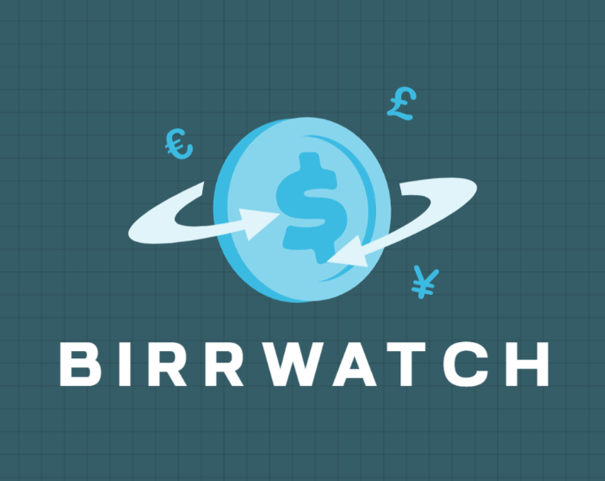
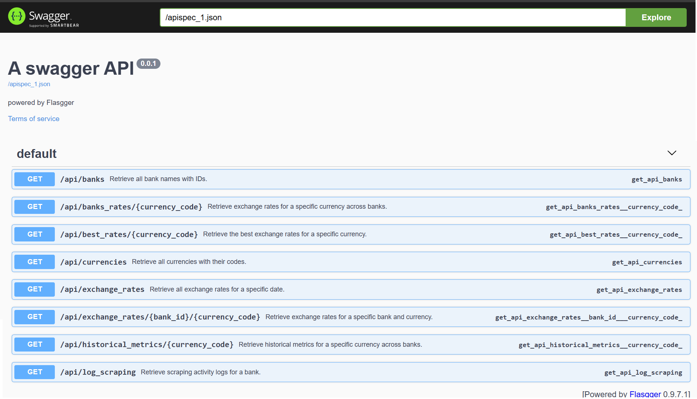
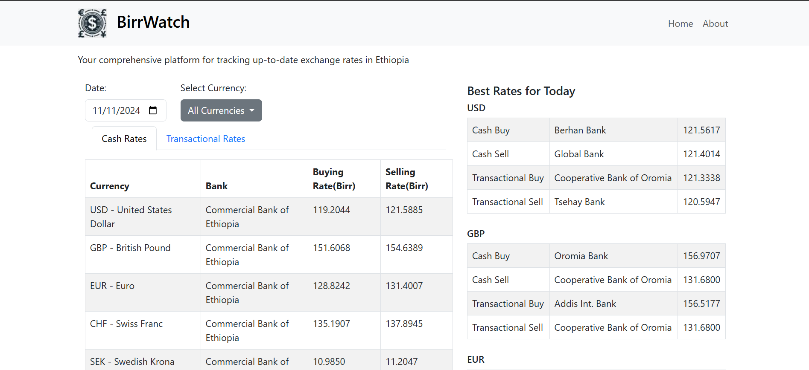

## BirrWatch

### Badges

(http://localhost:5000/apidocs/)

BirrWatch is a web platform that consolidates foreign exchange rates from multiple Ethiopian banks, providing users with up-to-date and easily accessible currency information. The platform automatically scrapes exchange rate data from over 20 banks and displays the rates in a simple, user-friendly interface.
### Project Goal
BirrWatch aims to simplify the process of comparing exchange rates across different banks by collecting, storing, and displaying exchange rate data in a centralized location. Users can view current rates, track currency trends, and make informed decisions without having to manually visit each bank’s website.

### Key Features
- Currency Comparison Table: Displays real-time exchange rates from various - banks side by side.  
- Interactive Graphs: Visualizes historical trends for currencies or compares rates between banks.  
- Automated Data Updates: Exchange rate data is refreshed automatically every few hours.  
- Responsive Design: The platform is mobile-friendly, providing a seamless experience across devices.  

### Technologies Used
Python: For web scraping and backend functionality.  
Flask: As the web framework for the backend and RESTful API.  
MySQL: To store the scraped exchange rate data.  
Alpine.js: For frontend interactivity.  
Bootstrap: For responsive and modern styling.  
Chart.js: To create interactive data visualizations.  

### API Documentation

This project includes an API for Getting exchange rates, scraping logs, and more. The API is built using **Flask** and **Flasgger** to automatically generate interactive Swagger documentation.

#### Accessing the API Documentation

Once the server is running, you can access the interactive API documentation via Swagger UI by visiting the following URL in your browser:  
[flask_url/apidocs](/apidocs)  

#### Accessing and Testing the API

Once the server is running, you can access the interactive API documentation  
To interact with the API and test endpoints, visit the following URL:  

[http://localhost:5000/apidocs/](http://localhost:5000/apidocs/)

Once you're there, you can use the "Try it out" button on the Swagger UI to make requests to any of the endpoints directly from the documentation.  

### Installation
Clone this repository:  
`git clone https://github.com/sofoniasgd/birrwatch.git`  

Navigate into the project directory:  
`cd birrwatch`  

Create a virtual enviroment  
`python -m venv venv`  

Activate the virtual enviroment  
`source venv/bin/activate`  

Install the required dependencies:  
`pip install -r requirements.txt`  

Set up the MySQL database:  
Create a new MySQL database.  
Configure your database connection settings in the .env file.  

Selenium Setup (***make sure to install both webdriver and browser***)  
- a webdriver is included with the setup- `/chromedriver-linux64.zip`
 - a separate webdriver setup is not needed with selenium version 4.6 and above
- extract the archive and place the executable `chromedriver` in `/usr/bin/`  
- a guide on how to setup selenium: https://www.geeksforgeeks.org/how-to-install-selenium-in-python/  

The data scrapung is set to run at 4Am everyday and can be changed from  
`scheduler.py`  
Run the application:  
`flask run`  

### Screenshots
#### Dashboard
  

### Roadmap
Here are some of the key features and improvements i plan to add to this project in the future: 

- [x] Basic API for fetching exchange rates
- [x] Swagger UI for interactive API documentation
- [ ] An alternative and more Robust Data collection mechanism
- [ ] Caching for faster response times on frequently requested data
- [ ] Historical data analysis and charts for exchange rates
- [ ] Deployment to production (e.g., Heroku, AWS)
- [ ] Mobile app for real-time exchange rate alerts

### License
This project is licensed under the MIT License.